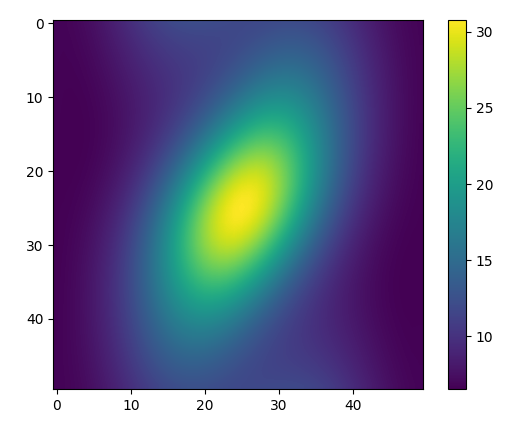

# Model of chemical diffusion through a medium using finite difference methods.

### Diffusion model laid out on a grid. A source term $\rho$ is located in the centre of the grid, and a spatially dependent velocity was added. This problem was found in a past paper for the Modelling and Visualisation in Physics course (paper.pdf). The dynamics of the system were studied to find when a steady state was reached and how concentration depended on radial distance from the source.

This is a visualisation of the concentration field in steady state with the source term located at the centre and the spatially dependent velocity leading to the deviation from circular symmetry. The concentration was found to drop off exponentially and reach steady state after about 2000 update cycles.

* diffusion.py contains the project code.
* results/ contains generated data and plots studying the system dynamics.

Run `python diffusion.py vis <dt~0.1>` to view an animation of the simulation.